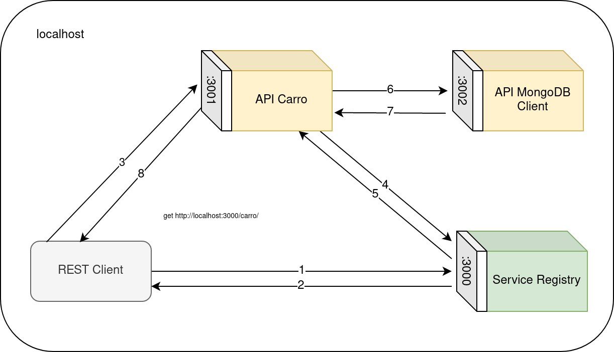

# EJERCICIO 3. CARRITO REST

## Arquitectura distribuida

Este ejercicio se ha realizado y desplegado en una única máquina, por lo que cada componente tendrá un puerto distinto desde el que estarán escuchando, ya que solo hay una única dirección IP disponible (127.0.0.1).

