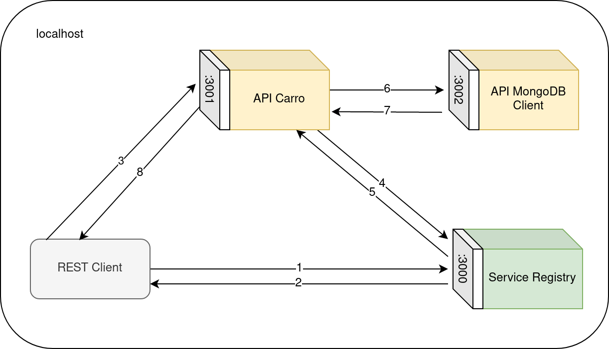

# EJERCICIO 3. CARRITO REST

## Arquitectura distribuida

Este ejercicio se ha realizado y desplegado en una única máquina, por lo que cada componente tendrá un puerto distinto desde el que estarán escuchando, ya que solo hay una única dirección IP disponible (127.0.0.1).

En la figura se muestra el esquema de los servicios una vez los dos (Carro y MongoDB Client) se han registrado en el Service Registry. Posteriormente, cuando se quiera acceder por primera vez a uno de los servicios, se deberá preguntar al service registry cual es la url necesaria para comunicarse con este. Una vez se haya obtenido, ya no hará falta volver a preguntarle.



## Service Registry

El Service Registy es el proveedor de la "ubicación" de cada servicio a quien lo recueste, y guardará la url de los servicios que quieran ofrecerse al mundo. Por lo tanto, será el primer componente en ponerse en marcha. 

La implementación de este Service Registry que se nos proporciona es algo limitada, ya que no tiene una persistencia fuerte, esto quiere decir que si por algún motivo el componente "muere", perderá todas las entradas de los servicios previamente guardados, y estos servicios deberán registrarse de nuevo. Como propuesta alternativa, se puede implementar un fichero json donde se guarden los servicios, y que sea independiente a la ejecución del programa, de esta manera, los cambios sucederían de manera permanente.

Para ofrecer siempre servicios "vivos", cada servicio tendrá un timeout de 10 segundos por defecto, una vez pasado el timeout, se eliminará el servicio. Esto va a requerir que cada componente registre su servicio cada 10 segundos (por lo menos) si quiere ser accesible en todo momento. Por otro lado, si un cliente quiere acceder a un servicio y obtiene una respuesta 404 puede volver a intentarlo en un tiempo o cancelar la opercación.

## Puesta en marcha, uso de CarritoAPI

Para poner en marcha la aplicación tenemos que ejecutar el ServiceRegistry para poder registrar los servicios de la aplicación. Además, después iniciamos el módulo APICarro para instanciar el servicio y obtener la conexión con MongoDB y ya responder al cliente REST. 

Para poder hacer uso del servicio, primero pediremos la url al service registry con 
`get("http://localhost:3000/find/CarritoAPI/v0")`. Si el servicio está registrado, se nos devolverá la ip y puerto desde el que está escuchando el servicio CarritoAPI. El siguiente paso es mandar una de las peticiones siguientes:
- `get("http://localhost:3001/CarritoAPI/v0/carritos/toString/:owner")`: El caso de uso toString, para mostrar el contenido del carrito.
- `post("http://localhost:3001/CarritoAPI/v0/carritos/addProduct", {owner, product, quantity})`: Para añadir una cantidad de un producto en concreto. Los parámetros se especifican en cuerpo de la petición.
- `post("http://localhost:3001/CarritoAPI/v0/carritos/removeProduct", {owner, product, quantity})`: Para eliminar una cantidad de un producto en concreto, si no existe el producto no se hace nada.

Podemos utilizar la herramienta `curl` para hacer peticiones a las API:
- `curl -X GET -i http://localhost:3000/find/CarritoAPI/v0` nos devuelve
-
```JavaScript
{"timestamp":1636150026,"ip":"[::ffff:127.0.0.1]","port":"3001","name":"CarritoAPI","version":"v0"}
```

- Con la url formada queremos ver nuestro carro `curl -X GET -i 'http://[::ffff:127.0.0.1]:3001/CarritoAPI/v0/carritos/toString/Fran'`. Como el carrito está vacío se muestra lo siguiente:
-
```JavaScript
{"status":true,"error":null,"content":{"owner":"Fran","products":{}}}
```

-Probamos a añadir 5 manzanas: `curl -X POST -i 'http://[::ffff:127.0.0.1]:3001/CarritoAPI/v0/carritos/addProduct' --data '{"owner":"Fran","product":"manzanas","quantity":5}'`, y si volvemos a hacer el toString, veremos que se muestran las manzanas en el carrito:

```JavaScript
{"status":true,"error":null,"content":{"owner":"Fran","products":{"manzanas":5}}}
```

## MongoClientAPI
La persistencia se consigue a través de MongoDB, los accesos a la base de datos se realizan a través de este servicio. Ofrece las entradas que CarritoAPI (get(toString), post(addProduct) y post(removeProduct)), pero en `repositories` se accederá a la base de datos con el módulo `mongodb`.
